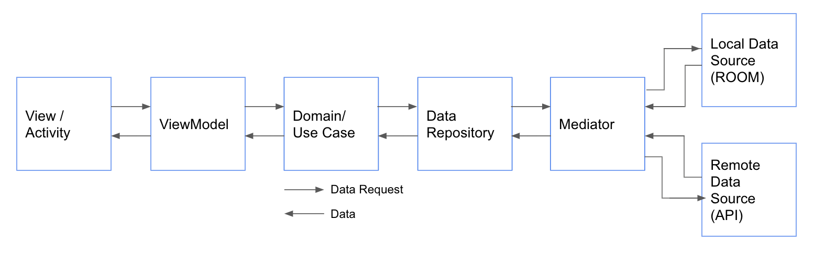

# album-app (Arthur: Kelvin Yung)
A sample album app built with Jetpack Compose.

# Design Pattern / Architecture
## MVVM:
- used livedata to update UI / data automatically
- less coupling between view model and UI
- Comparing to MVP, we do not use interface for UI/data data, reduces the chance of memory leak
  (livedata is lifecycle aware)
- it is easy to implement, thanks to Google Jetpack

## Clean Architecture:
### Divided into three layers:
Presentation layer
- Activity and view model (i.e. MainActivity.kt, Album Card UI)

Domain layer
- Use cases (Skipped this layer in this project since there is no business logic involved in this album app)

Data layer
- Data Repository + Mediator class, places to decide whether we fetch the source of data
- Local data source: From Room database
- Remote data source: Api

# Key Libraries / components
- Jetpack Compose: Drawing UI
- Retrofit: Call Api
- Kotlin coroutine: Manage threading
- Dagger Hilt: Dependency injection and for testing purpose
- Room: Store data in local database for speeding up initial load time
- Paging3: For api pagination
- JUnit: For UI and Unit testing

# Improvement
- Finding a way to pass boolean to MockAlbumRepository for getting different mock album object for unit testing and ui testing
- For future reusability, should not hard code term and entity value in viewModel, instead, should pass from UI, i.e. albumRepository.getAllAlbums("jack+johnson", "album")
